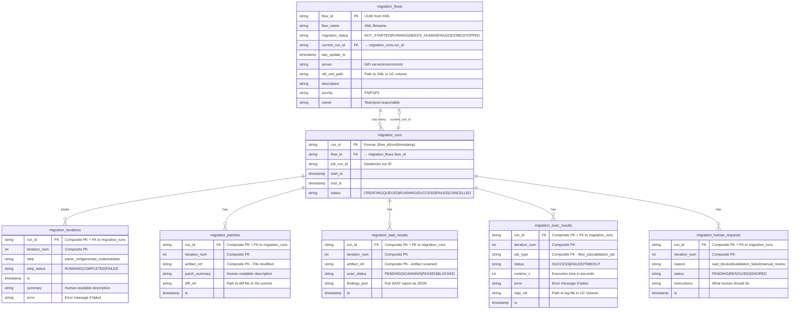

# Database Schema - NiFi to Databricks Migration System

This document describes the 7-table schema for tracking NiFi flow migrations to Databricks.

## Architecture Philosophy

> "The App should never 'compute' progress. It should display the latest rows and statuses written by the job."

The schema follows a hub-and-spoke pattern with `migration_runs` as the central table connecting all tracking tables.

## Entity Relationship Diagram



## Table Descriptions

### 1. migration_flows (Master Registry)
**Purpose:** Master list of NiFi flows to migrate. Points to current run, never computes progress.

**Key Fields:**
- `flow_id` (PK): UUID extracted from XML `<rootGroup id="...">`
- `migration_status`: Overall status of the flow migration
- `current_run_id` (FK): Points to the active/latest run

**Relationship:** One flow can have many runs over time.

---

### 2. migration_runs (Run Tracking)
**Purpose:** One row per orchestrator run. Links flows to Databricks job runs.

**Key Fields:**
- `run_id` (PK): Format `{flow_id}_run_{timestamp}`
- `flow_id` (FK): Links back to migration_flows
- `job_run_id`: Databricks run ID for tracking in Databricks UI

**Relationship:** Central hub connecting all tracking tables.

---

### 3. migration_iterations (Progress Events)
**Purpose:** Step-by-step progress trail. Agent writes one row per step.

**Key Fields:**
- **Composite PK:** `(run_id, iteration_num)`
- `run_id` (FK): Links to migration_runs
- `step`: Type of work being done
- `step_status`: Status of this specific step

**Relationship:** Many iterations per run (one per agent iteration).

---

### 4. migration_patches (Code Changes Audit)
**Purpose:** Tracks what code was changed by agent. For review and audit.

**Key Fields:**
- **Composite PK:** `(run_id, iteration_num, artifact_ref)`
- `run_id` (FK): Links to migration_runs
- `artifact_ref`: Which file/artifact was modified
- `diff_ref`: Path to diff file or Git commit

**Relationship:** Multiple patches per iteration (one per modified file).

---

### 5. migration_sast_results (Security Gates)
**Purpose:** Security scan results. If BLOCKED, stop and mark NEEDS_HUMAN.

**Key Fields:**
- **Composite PK:** `(run_id, iteration_num, artifact_ref)`
- `run_id` (FK): Links to migration_runs
- `scan_status`: Gates execution (BLOCKED prevents deployment)
- `findings_json`: Full security scan report

**Relationship:** Multiple scan results per iteration (one per artifact).

---

### 6. migration_exec_results (Validation Results)
**Purpose:** Results of running generated notebooks. Validation pass/fail.

**Key Fields:**
- **Composite PK:** `(run_id, iteration_num, job_type)`
- `run_id` (FK): Links to migration_runs
- `job_type`: Type of job executed
- `status`: SUCCESS/FAILED/TIMEOUT
- `logs_ref`: Path to execution logs in UC Volume

**Relationship:** Multiple execution results per iteration (flow job + validation job).

---

### 7. migration_human_requests (Intervention Queue)
**Purpose:** When agent cannot proceed, create request for human guidance.

**Key Fields:**
- **Composite PK:** `(run_id, iteration_num)`
- `run_id` (FK): Links to migration_runs
- `reason`: Why human help is needed
- `status`: PENDING until human resolves

**Relationship:** Zero or one request per iteration (only when needed).

---

## Data Flow Example

```
1. Flow registered
   → migration_flows: flow_id="abc-123", status="NOT_STARTED"

2. Conversion started
   → migration_runs: run_id="abc-123_run_1706543210", status="RUNNING"
   → migration_flows: current_run_id="abc-123_run_1706543210", status="RUNNING"

3. Agent iteration 1
   → migration_iterations: iteration_num=1, step="generate_code", status="RUNNING"
   → migration_patches: artifact_ref="processor_1.py", patch_summary="Created new processor"
   → migration_iterations: iteration_num=1, step="generate_code", status="COMPLETED"

4. Security scan
   → migration_sast_results: scan_status="PASSED"

5. Execution test
   → migration_exec_results: job_type="validation_job", status="FAILED"

6. Agent iteration 2 (fix errors)
   → migration_iterations: iteration_num=2, step="fix_errors", status="RUNNING"
   → migration_patches: artifact_ref="processor_1.py", patch_summary="Fixed validation errors"
   → migration_exec_results: job_type="validation_job", status="SUCCESS"
   → migration_iterations: iteration_num=2, step="fix_errors", status="COMPLETED"

7. Completion
   → migration_runs: status="SUCCESS", end_ts=now()
   → migration_flows: status="DONE"
```

## Key Design Principles

1. **No Computed Progress**: App displays the latest row statuses, never calculates progress
2. **Hub-and-Spoke**: `migration_runs` is the central table linking everything
3. **Audit Trail**: Every change (patch, scan, execution) is recorded with timestamp
4. **Human in the Loop**: System explicitly requests human help when stuck
5. **Minimal v0**: Start simple, add fields as needed (avoid over-engineering)

## Indexes

Performance-critical indexes are created on:
- `migration_flows.flow_name`, `migration_flows.migration_status`
- `migration_runs.flow_id`, `migration_runs.job_run_id`, `migration_runs.status`
- `migration_iterations.run_id`, `migration_iterations.step`

## Implementation Notes

- All tables use Delta Lake format for ACID transactions
- Primary keys are enforced via Delta table constraints
- Foreign key relationships are logical (not enforced by Delta)
- Models are implemented as Python dataclasses in `models/` directory
- Tables are created via `setup/setup_complete.py` notebook
